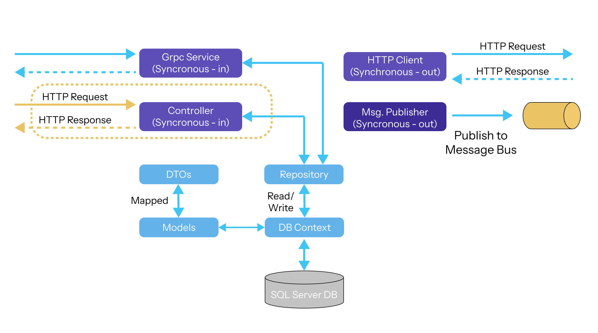
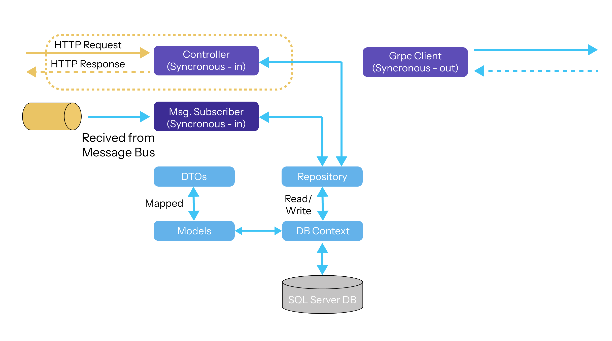

# .NET Microservices Platform Commands

Welcome to the .NET Microservices Platform Commands repository. This project contains a collection of commands and utilities to help you manage and deploy microservices using .NET.

## Table of Contents

- [Introduction](#introduction)
- [Getting Started](#getting-started)
- [Services](#services)
- [Solution Architecture](#solution-architecture)
- [Platform Architecture](#platform-architecture)
- [Commands Architecture](#commands-architecture)

## Services

### The Platform Service

- Functions as an "Asset Register"
- Tracks all the platforms/systems in the company
- Built by the infrastructure team
- Used by:
    - Infrastructure Team
    - Technical Support Team
    - Engineering
    - Accounting
    - Procurement

### The Commands Service

- Functions as a repository of command line arguments for given platforms
- Aids in the automation of support processes
- Built by the Technical Support Team
- Used by:
    - Technical Support Team
    - Infrastructure Team
    - Engineering

## Solution Architecture

### Platform Architecture

### Commands Architecture

## Introduction

This repository provides a set of commands to streamline the development, deployment, and management of microservices built with .NET. It aims to simplify common tasks and improve productivity for developers working with microservices architectures.
## Project Development

.NET Microservices Platform Commands project steps:

1. **Set up your development environment**:
    - Install dependencies.
